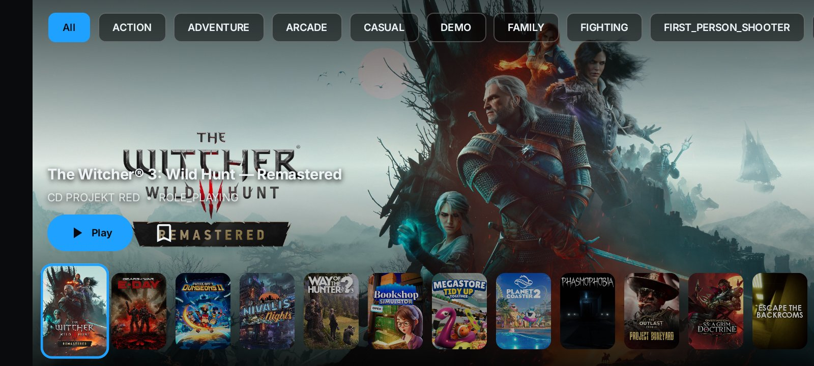

<p align="center">
  
</p>

<h1 align="center">NanaPlay</h1>

<p align="center">
  <strong>An open-source Android client for GeForce NOW — reimagined.</strong>
</p>

<p align="center">
  <a href="https://github.com/FahriAdison/NanaPlay/releases/latest">
    
  </a>
</p>

<p align="center">
  
  
  
</p>

<p align="center">
  
  
</p>

> [!WARNING]
> **NanaPlay is in BETA.** It works, and it's tested on real devices — but expect rough edges. Bug reports are welcome!

NanaPlay is a community fork of [OpenNOW](https://github.com/OpenCloudGaming/OpenNOW) by [Zortos](https://github.com/OpenCloudGaming), rebuilt and redesigned for Android by **Papah Chan** ([FahriAdison](https://github.com/FahriAdison)).

It keeps everything great about OpenNOW's GeForce NOW streaming, and adds a console-style experience, smarter queue handling, and tools for players on slower networks.

## 📸 Screenshots

<p align="center">
  
</p>
<p align="center"><em>Console Mode — PS5-style interface in landscape</em></p>

## ✨ Features

- **🎮 Console Mode** — PS5-style interface with game artwork backdrops, horizontal card strips, D-pad navigation, and immersive fullscreen landscape
- **📋 Queue Redesign** — route picker with ping bars and ETAs, full-screen queue position screen with live countdown, and a matching minimized queue bar
- **🔁 Persistent Reconnect** — optional unlimited auto-reconnect with backoff for poor networks, plus automatic fallback to a safe low-bandwidth profile (great for < 4 Mbps connections)
- **⏺️ Stream Recording** — record your stream to MP4 via Storage Access Framework
- **📸 Screenshot** — capture the stream with PixelCopy, saved as PNG
- **⚡ Quick Access FAB** — floating draggable button for keyboard, touch/controller toggle, and screenshot
- **🔊 Low-Latency Audio** — toggle for reduced audio delay
- **🔍 Full Search** — game search in both Classic and Console modes
- **🎵 Music Player** — local files + online streaming (JioSaavn), playable outside and inside the stream
- **🌐 Floating Browser** — lightweight WebView over the stream for maps & guides
- **📢 Announcements** — in-app popups for important updates

## 📦 Package info

- Package: `com.papahchan.nanaplay`
- Label: **NanaPlay**
- This package is **different from upstream OpenNOW**, so it can be installed **side-by-side** with the original app.
- ⚠️ If you previously installed a NanaPlay build with the old package (`com.opencloudgaming.opennow`), this is a **fresh install** — uninstall the old one first (your login is server-side, so just sign in again).

## 🔨 Building

Requirements: **JDK 17**, Android SDK (compileSdk 37), Gradle 9.x.

```bash
cd android
./gradlew assembleRelease
```

The APK lands in `android/app/build/outputs/apk/release/`. Release builds use R8 minification + resource shrinking.

> **Signing:** release builds expect a keystore configured as the `nanaplay` signing config. Never commit keystores — see `.gitignore`.

## 🗂️ Repository Layout

```
.
├── android/                    # Android app (Jetpack Compose + Kotlin)
│   ├── app/
│   │   ├── src/main/
│   │   │   ├── java/com/opencloudgaming/opennow/   # App source
│   │   │   │   ├── Nana*.kt    # NanaPlay additions (music, browser, announcements…)
│   │   │   │   └── OpenNow*.kt # Upstream OpenNOW base (streaming, queue, auth…)
│   │   │   └── res/            # Resources
│   │   └── build.gradle.kts
│   └── gradle.properties
├── announcements.json          # In-app announcement feed
├── logo.png                    # App icon
├── screenshot-console.png      # Console Mode screenshot
├── README.md
└── LICENSE
```

## 🗒️ Changelog

The changelog is updated with every release. Highlights:

| Version | Code | Highlights |
|---------|------|------------|
| 1.0.37 | 92 | Touch session recovery (ported from upstream); recovery fail-fast |
| 1.0.36 | 91 | Music player reliability rework; auto-advance to next track |
| 1.0.35 | 90 | Gamepad overlap fix; floating browser URL fix; music replay fix |
| 1.0.34 | 89 | In-app announcement popup via GitHub JSON |
| 1.0.33 | 88 | Search state persistence; 50 music results; gamepad restyle; floating drawer |
| 1.0.32 | 87 | JioSaavn parser fix (`data.results`) |
| 1.0.31 | 86 | **Online music** backend switched to JioSaavn (was YouTube InnerTube) |
| 1.0.26 | 81 | **Online music** in the music player (YouTube Music search via InnerTube) |
| 1.0.25 | 80 | Local music player; NanaPlay home identity; instant Classic search; search-stuck & back-button fixes |
| 1.0.24 | 79 | Queue stuck warning + retry; session auto-retry; faster touch drag; Low Latency preset |
| 1.0.23 | 78 | Compact recommended card; keyboard bar alignment; slim quick-access status bar + toggle |
| 1.0.22 | 77 | Update checker reads NanaPlay's own GitHub releases (tag `v<name>+<code>`) |
| 1.0.21 | 76 | Critical launch-crash fix (fully-qualified manifest components) |
| 1.0.20 | 75 | **New package** `com.papahchan.nanaplay` (side-by-side with OpenNOW); initial GitHub release |
| 1.0.19 | 74 | Immersive fix for queue minimize/view; **Persistent reconnect** for poor networks |
| 1.0.18 | 73 | Minimized queue bar redesigned to match the new queue screen |
| 1.0.17 | 72 | First fully optimized **release** build (R8 + resource shrinking, ~46 MB) |
| 1.0.16 | 71 | Scroll-state perf pass (`derivedStateOf`) for Store/Library |
| 1.0.15 | 70 | Classic thumbnails; lighter Console landscape; new queue-position screen |
| 1.0.14 | 69 | Route/queue picker redesign (recommended hero, ping bars, ETAs) |
| 1.0.13 | 68 | Smaller Console thumbnails; immersive Settings/Search in landscape |
| 1.0.12 | 67 | True immersive fullscreen Console landscape; lighter UI; nav rail auto-hide |
| 1.0.11 | 66 | Landscape fixes; Search enabled in Console Mode |
| 1.0.10 | 65 | First **Console Mode** (PS5-style UI) |

## ⭐ Star History

[](https://star-history.com/#FahriAdison/NanaPlay&Date)

## 🙏 Credits

- **Upstream:** [OpenNOW](https://github.com/OpenCloudGaming/OpenNOW) by [Zortos](https://github.com/OpenCloudGaming) — the foundation everything here is built on. Android contributions by [Kief5555](https://github.com/Kief5555).
- **Recode & redesign:** [Papah Chan](https://github.com/FahriAdison)
- **Online music:** streams via the [JioSaavn](https://www.jiosaavn.com) catalog using the ShnwazDev public API wrapper (based on [sumitkolhe/jiosaavn-api](https://github.com/sumitkolhe/jiosaavn-api), MIT). (1.0.26–1.0.30 used YouTube InnerTube, inspired by [Metrolist](https://github.com/MetrolistGroup/Metrolist) (GPL-3.0); retired for reliability.)

## 📄 License

MIT License — see [LICENSE](LICENSE). Original copyright (c) 2025 Zortos, retained as required by the license.
